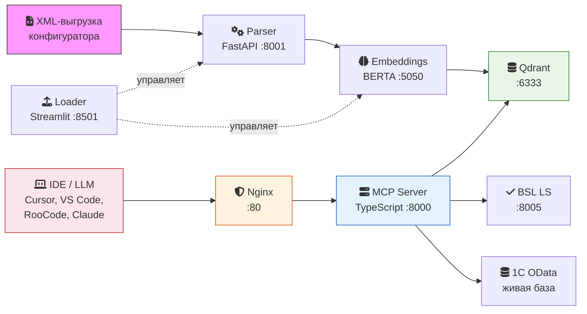
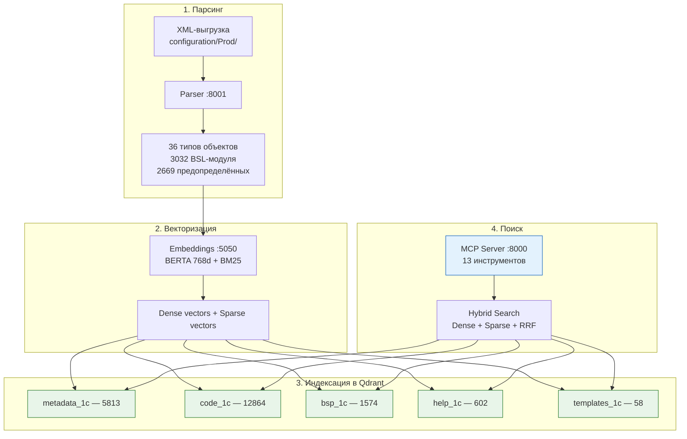
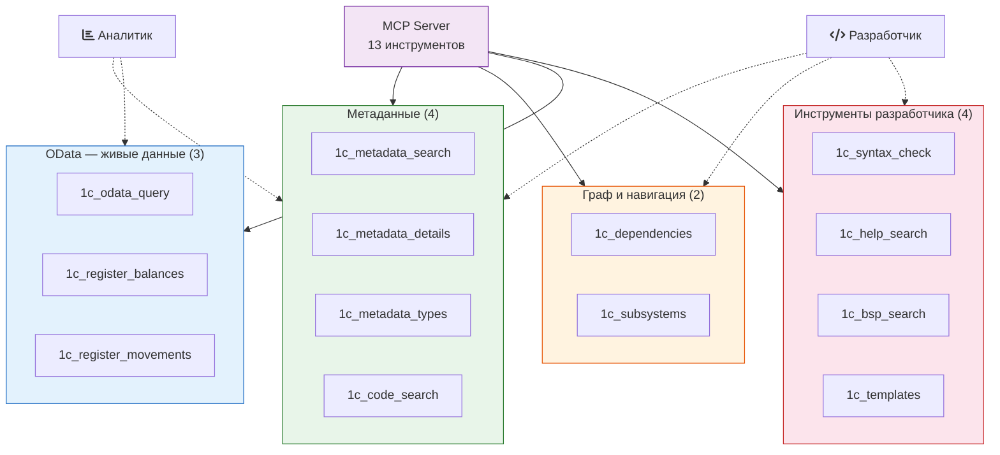

# MCP RAQ 1C

MCP-сервер с RAG, который даёт ИИ точные знания о вашей конфигурации 1С вместо галлюцинаций.

## Какую проблему решает

Большие языковые модели хорошо знают типовые конфигурации 1С — «Бухгалтерию», «Управление торговлей». Но когда речь идёт о редких, отраслевых или сильно доработанных конфигурациях — модели **выдумывают** имена объектов, реквизитов и регистров, которых не существует.

MCP RAQ 1C решает эту проблему: ИИ-агент через MCP-протокол **запрашивает реальную структуру конфигурации** и генерирует код с правильными именами объектов.

### Пример

Вы спрашиваете агента:
> Напиши запрос, который выводит все заказы клиентов за сегодня с суммой больше 100 000

Агент:
1. Вызывает `1c_metadata_search("заказ клиента")` → находит документ `SS_ЗаказКлиента`
2. Вызывает `1c_metadata_details("SS_ЗаказКлиента")` → получает реквизиты: `СуммаДокумента (Число(15,2))`, `Статус`, табличную часть `Состав`
3. Генерирует корректный запрос с **реальными** именами объектов и полей

---

## Для кого

### Аналитик 1С

Бизнес-аналитик, который работает с данными в 1С: анализирует продажи, остатки, маржинальность, дебиторку. Не обязательно пишет код, но хочет задавать вопросы на естественном языке и получать ответы на основе реальных данных.

**Что даёт аналитику:**
- Поиск нужных объектов по описанию на русском (*«регистр учёта партий»*, *«справочник контрагентов»*)
- Запросы к живой базе 1С через OData — остатки, обороты, движения регистров
- Аналитический скилл Claude Code с 50+ паттернами бизнес-анализа (ABC/XYZ, маржинальность, оборачиваемость, динамика)

**Пример:** *«Покажи топ-10 товаров по выручке за последний месяц»* — система найдёт нужный регистр, выполнит OData-запрос и вернёт данные.

### Разработчик 1С

Разработчик, который пишет код на BSL, дорабатывает конфигурацию, создаёт отчёты и обработки. Работает в IDE с ИИ-ассистентом (Cursor, VS Code + Copilot, RooCode).

**Что даёт разработчику:**
- Точные имена объектов, реквизитов, табличных частей, регистров — без галлюцинаций
- Граф зависимостей: какие документы пишут в регистр, что затронется при изменении
- Поиск по существующему BSL-коду: найти пример обработки проведения или расчёта
- Навигация по подсистемам: понять бизнес-роль объекта в конфигурации
- Справка по платформе, шаблоны кода, проверка синтаксиса, документация БСП

**Пример:** *«Напиши обработку проведения для документа ПриходнаяНакладная»* — система покажет структуру документа, его регистры-приёмники, существующий код проведения, и ИИ сгенерирует корректный код.

---

## Архитектура



### Пайплайн индексации



### 7 сервисов в Docker

| Сервис | Технология | Роль | Локально | VPS |
|---|---|---|:---:|:---:|
| **nginx** | Reverse proxy | Единая точка входа, auth для Loader, SSE support | — | ok |
| **parser** | Python / FastAPI | Парсит XML-выгрузку: 36 типов объектов, 3032 BSL-модуля, 2669 предопределённых | ok | ok |
| **embeddings** | Python / BERTA | Векторизация: dense-эмбеддинги (768d) + sparse BM25 | ok | ok |
| **qdrant** | Qdrant v1.13 | Векторная БД: гибридный поиск dense + sparse с RRF-фьюжном | ok | ok |
| **loader** | Python / Streamlit | UI индексации: метаданные, BSL-код, справка, БСП, шаблоны | ok | ok |
| **mcp-server** | TypeScript / Node.js | HTTP MCP-сервер (Streamable HTTP + SSE), 13 инструментов | ok | ok |
| **bsl-ls** | Java / Flask sidecar | BSL Language Server для проверки синтаксиса | ok | ok |

### 5 коллекций Qdrant

| Коллекция | Содержимое | Локально | VPS |
|---|---|---|---|
| `metadata_1c` | Объекты метаданных (36 типов) | 5 813 | 5 813 |
| `code_1c` | Чанки BSL-кода модулей | 12 864 | 15 440 |
| `bsp_1c` | Документация БСП | 1 574 | 1 574 |
| `help_1c` | Справка по платформе 1С | 602 | 602 |
| `templates_1c` | Шаблоны кода | 58 | 58 |

---

## 13 MCP-инструментов



### Метаданные (4)

| Инструмент | Назначение | Кто использует |
|---|---|---|
| `1c_metadata_search` | Гибридный поиск объектов (BERTA + BM25 + RRF) | Оба |
| `1c_metadata_details` | Структура объекта: реквизиты, ТЧ, движения | Оба |
| `1c_metadata_types` | Статистика по типам объектов | Оба |
| `1c_code_search` | Поиск по BSL-коду: процедуры, функции | Разработчик |

### Граф и навигация (2)

| Инструмент | Назначение | Кто использует |
|---|---|---|
| `1c_dependencies` | Граф зависимостей: документ ↔ регистры | Разработчик |
| `1c_subsystems` | Навигация по подсистемам (дерево, содержимое, поиск) | Оба |

### OData — живые данные (3)

| Инструмент | Назначение | Кто использует |
|---|---|---|
| `1c_odata_query` | Универсальный OData-запрос к 1С | Аналитик |
| `1c_register_balances` | Остатки/обороты регистров накопления | Аналитик |
| `1c_register_movements` | Движения регистров за период | Аналитик |

### Инструменты разработчика (4)

| Инструмент | Назначение | Кто использует |
|---|---|---|
| `1c_syntax_check` | Проверка синтаксиса BSL-кода | Разработчик |
| `1c_help_search` | Справка по платформе 1С | Разработчик |
| `1c_bsp_search` | Поиск по документации БСП | Разработчик |
| `1c_templates` | Шаблоны кода 1С | Разработчик |

---

## Доступ к живым данным 1С

Данные из живой базы 1С доступны через **стандартный интерфейс OData** — не требует изменения конфигурации.

### OData

Работает через 3 MCP-инструмента: `1c_odata_query`, `1c_register_balances`, `1c_register_movements`.

**Что включено сейчас:**
- 6 регистров: ДвижениеТМЦ, УчетПартий, ПартииНоменклатуры, Реализация, Отгрузка, УчетВзаиморасчетов
- 4 справочника: Номенклатура, Склады, Организации, Контрагенты
- 5 документов: РеализацияТоваровУслуг, ПоступлениеТоваровУслуг, ПеремещениеТоваров, СписаниеТоваров, ИнвентаризацияТоваров

**Особенности OData:**
- Доступ пообъектно — только к включённым в состав OData
- Ссылочные поля возвращают GUID (суффикс `_Key`) — для наименований нужен отдельный запрос к справочнику
- Виртуальные таблицы: `/Balance`, `/Turnovers`, `/BalanceAndTurnovers`, `_SliceLast`

Настройка: [odata-setup.md](docs/odata-setup.md)

### HTTP-сервис Queries (планируется)

Для сложной аналитики (JOIN, GROUP BY, подзапросы, виртуальные таблицы с параметрами). Требует добавления HTTP-сервиса в конфигурацию 1С.

Код модуля и инструкция по установке: [1c-service/](1c-service/)

---

## Скилл `1c-analyst` (Claude Code)

Аналитический ассистент для работы с данными 1С через Claude Code. Активируется автоматически на бизнес-вопросы по данным 1С.

**Возможности:**
- Анализ продаж, остатков, маржинальности, оборачиваемости, дебиторки/кредиторки
- ABC/XYZ-анализ, сравнение периодов, поиск проблем в данных
- Формирование OData-запросов к живой базе 1С
- Расследование проблем в данных (отрицательные остатки, дубли, непроведённые документы)
- 30 паттернов бизнес-анализа

**Триггеры:** «проанализируй продажи», «остатки на складе», «какова маржа?», «ABC-анализ», «кто должен нам денег?», «получи техкарты» и др.

Скилл установлен глобально (`~/.claude/skills/1c-analyst/`) и доступен из любого проекта.

---

## С какими конфигурациями работает

Система поддерживает **любую конфигурацию 1С:Предприятие 8.3**, выгруженную в XML через конфигуратор.

Протестирована на конфигурации **ASTOR «Торговый дом 7 SE»** — отраслевая ERP для оптовой и розничной торговли (~5800 объектов метаданных, 3032 BSL-модуля).

Для подключения новой конфигурации:
1. Выгрузить конфигурацию: `Конфигуратор → Выгрузить конфигурацию в файлы` в `configuration/Prod/`
2. Запустить `docker compose up -d`
3. Открыть Loader UI и нажать **«Индексировать»**

---

## Чем отличается от других решений

Существуют и другие MCP-серверы для 1С (comol/DISTAR). Ключевые отличия:

| Возможность | MCP RAQ 1C | Другие решения |
|---|---|---|
| **OData-интеграция** — запросы к живой базе 1С | 3 инструмента | Нет |
| **Навигация по подсистемам** — бизнес-структура конфигурации | Есть (рекурсивная) | Нет |
| **Аналитический скилл** — 30 паттернов бизнес-анализа | Есть (Claude Code) | Нет |
| **Гибридный поиск** — BERTA + BM25 + RRF fusion | Есть | ChromaDB (только dense) |
| **Граф зависимостей** — без тяжёлых зависимостей | Qdrant (лёгкий) | Neo4j + OpenAI (тяжёлый) |
| **Справка + БСП + шаблоны** — встроены в MCP-сервер | 4 инструмента | Отдельные серверы comol |

---

## Быстрый старт

### Требования

- Docker Desktop (macOS / Windows / Linux)
- XML-выгрузка конфигурации 1С в `configuration/Prod/`
- Для OData-инструментов: публикация информационной базы на веб-сервере

### Запуск

```bash
git clone https://github.com/Antiloop-git/MCP-RAQ-1C.git
cd MCP_RAQ_1C

cp .env.example .env
docker compose up -d

# Проверить здоровье
curl http://localhost:8001/health   # parser
curl http://localhost:8000/health   # mcp-server

# Открыть Loader для индексации
open http://localhost:8501
```

### Подключение к IDE

Единственный MCP endpoint — достаточно для всех 13 инструментов:

```json
{
  "mcpServers": {
    "1c-metadata": {
      "url": "http://localhost:8000/mcp"
    }
  }
}
```

Подробные инструкции для каждой IDE:
- [Claude Code](docs/claude-code-setup.md)
- [Cursor](docs/cursor-setup.md)
- [VS Code](docs/vscode-setup.md)
- [RooCode](docs/roocode-setup.md)

---

## Точки доступа

### VPS (продакшн)

| Сервис | URL | Авторизация |
|---|---|---|
| **MCP endpoint** | `http://10.1.231.253/mcp` | — |
| **Health check** | `http://10.1.231.253/health` | — |
| **Loader UI** | `http://10.1.231.253/loader/` | Basic Auth: `admin` / `mcp-loader-2026` |

Все внутренние порты (8000, 8001, 5050, 6333, 8501, 8005) закрыты снаружи. Доступ только через Nginx :80.

Auto-deploy: cron каждые 2 мин опрашивает GitHub и пересобирает изменённые сервисы.

### Локально (разработка)

| Сервис | URL |
|---|---|
| **MCP endpoint** | `http://localhost:8000/mcp` |
| **Health check** | `http://localhost:8000/health` |
| **Parser API** | `http://localhost:8001/health`, `/stats`, `/parse/{type}/{name}` |
| **Loader UI** | `http://localhost:8501` |
| **Qdrant Dashboard** | `http://localhost:6333/dashboard` |
| **Embeddings** | `http://localhost:5050/health` |
| **BSL LS** | `http://localhost:8005/health` |

---

## Статус

**Версия:** 0.4.0 (март 2026)

**Что готово:**
- Полный пайплайн: XML Parser → Embedding Service → Qdrant → MCP Server
- 7 сервисов работают в Docker
- 13 MCP-инструментов
- 5 коллекций Qdrant проиндексированы (20 911 чанков суммарно)
- 1 аналитический скилл Claude Code
- VPS развёрнут с auto-deploy

**Что в работе:**
- SSL-сертификат для VPS
- Тестирование на реальных задачах с аналитиками и разработчиками

## Документация

- [tools-map.md](docs/tools-map.md) — карта инструментов и инфраструктуры
- [agents.md](docs/agents.md) — инструкция для LLM-агентов (копировать в корень 1С-проекта)
- [ide-setup.md](docs/ide-setup.md) — настройка IDE
- [odata-setup.md](docs/odata-setup.md) — настройка OData для доступа к живым данным
- [1c-service/](1c-service/) — HTTP-сервис для выполнения запросов 1С (планируется)

## Лицензия

MIT
