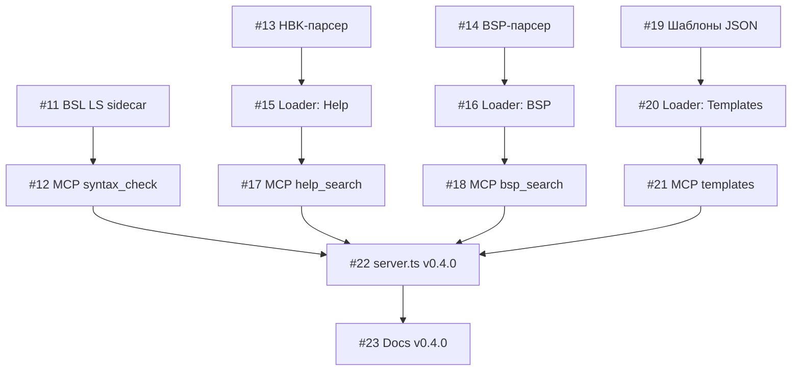

# Карта задач v0.4.0 — Инструменты разработчика 1С

**PRD:** [PRD-dev-tools-v0.4.md](PRD-dev-tools-v0.4.md)
**Репозиторий:** [Antiloop-git/MCP-RAQ-1C](https://github.com/Antiloop-git/MCP-RAQ-1C)

## Сводная таблица

| Issue | Задача | Компонент | Приоритет | Размер | Зависит от |
|-------|--------|-----------|-----------|--------|------------|
| [#11](https://github.com/Antiloop-git/MCP-RAQ-1C/issues/11) | BSL LS sidecar-контейнер | infra | P0 | M | — |
| [#12](https://github.com/Antiloop-git/MCP-RAQ-1C/issues/12) | MCP 1c_syntax_check | backend | P0 | S | #11 |
| [#13](https://github.com/Antiloop-git/MCP-RAQ-1C/issues/13) | HBK-парсер справки платформы | parser | P0 | M | — |
| [#14](https://github.com/Antiloop-git/MCP-RAQ-1C/issues/14) | Парсер справки БСП | parser | P0 | S | — |
| [#15](https://github.com/Antiloop-git/MCP-RAQ-1C/issues/15) | Loader: Справка платформы | loader | P1 | M | #13 |
| [#16](https://github.com/Antiloop-git/MCP-RAQ-1C/issues/16) | Loader: Справка БСП | loader | P1 | S | #14 |
| [#17](https://github.com/Antiloop-git/MCP-RAQ-1C/issues/17) | MCP 1c_help_search | backend | P1 | S | #15 |
| [#18](https://github.com/Antiloop-git/MCP-RAQ-1C/issues/18) | MCP 1c_bsp_search | backend | P1 | S | #16 |
| [#19](https://github.com/Antiloop-git/MCP-RAQ-1C/issues/19) | Коллекция шаблонов (50+) | data | P1 | L | — |
| [#20](https://github.com/Antiloop-git/MCP-RAQ-1C/issues/20) | Loader: Шаблоны кода | loader | P1 | S | #19 |
| [#21](https://github.com/Antiloop-git/MCP-RAQ-1C/issues/21) | MCP 1c_templates | backend | P1 | S | #20 |
| [#22](https://github.com/Antiloop-git/MCP-RAQ-1C/issues/22) | server.ts — регистрация v0.4.0 | backend | P0 | S | #12,#17,#18,#21 |
| [#23](https://github.com/Antiloop-git/MCP-RAQ-1C/issues/23) | Документация v0.4.0 | docs | P2 | S | все |

## Карта зависимостей

## Статистика

- **Всего:** 13 задач
- **P0:** 5 (блокеры: sidecar, парсеры, server.ts)
- **P1:** 7 (основная работа: loader, MCP tools, шаблоны)
- **P2:** 1 (документация)
- **Размеры:** S×8, M×3, L×1

## Параллельные потоки

Можно вести 3 потока одновременно:

1. **Syntax Check:** #11 → #12 → #22
2. **Help + BSP:** #13 + #14 (параллельно) → #15 + #16 → #17 + #18 → #22
3. **Templates:** #19 → #20 → #21 → #22

Финализация: #22 (server.ts) → #23 (docs)

## Старт

Начинать с задач **без зависимостей:**
- [#11](https://github.com/Antiloop-git/MCP-RAQ-1C/issues/11) — BSL LS sidecar
- [#13](https://github.com/Antiloop-git/MCP-RAQ-1C/issues/13) — HBK-парсер
- [#14](https://github.com/Antiloop-git/MCP-RAQ-1C/issues/14) — BSP-парсер
- [#19](https://github.com/Antiloop-git/MCP-RAQ-1C/issues/19) — Коллекция шаблонов
