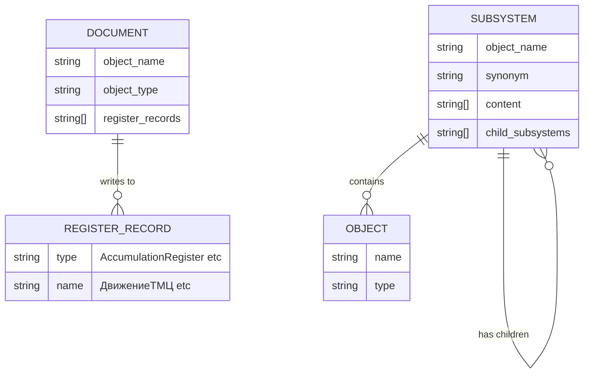

# PRD: MCP-сервер 1С v0.3 — зависимости, подсистемы, comol-интеграция

---
project_name: mcp-raq-1c
repo: local (MCP_RAQ_1C)
stack:
  backend: TypeScript (MCP SDK + Express)
  database: Qdrant (vector DB)
  infrastructure: Docker Compose
mvp_deadline: "не определён"
---

## 1. Обзор

Расширение MCP-сервера для метаданных 1С с 7 до 9 собственных инструментов (`1c_dependencies`, `1c_subsystems`) и интеграция 4 готовых comol/DISTAR MCP-серверов (справка платформы, шаблоны, синтаксис, БСП). Целевая аудитория — разработчики и аналитики 1С, работающие с конфигурацией ASTOR "Торговый дом 7 SE" (~5800 объектов) через AI-агенты в IDE (Cursor, VS Code Copilot, RooCode).

## 2. Проблема

### Текущая ситуация (as-is)
- MCP-сервер имеет 7 инструментов: поиск метаданных (3), поиск кода (1), OData (3)
- Разработчик **не может** узнать связи между объектами: «какие документы пишут в регистр ДвижениеТМЦ?», «что сломается, если изменить справочник Номенклатура?»
- Нет навигации по подсистемам (248 шт.) — разработчик не понимает бизнес-структуру незнакомой конфигурации
- Документация `agents.md` описывает только 3 из 7 инструментов — LLM-агенты не знают про OData и code_search
- Доступные comol MCP-серверы (справка, шаблоны, синтаксис) не подключены

### Боли пользователей
1. **Разработчик 1С**: «Я изменил реквизит справочника, а потом 5 документов и 3 регистра сломались. Хочу заранее видеть зависимости»
2. **Новый разработчик**: «Пришёл на проект, не понимаю где что — 5800 объектов, нет карты по подсистемам»
3. **Аналитик**: «Агент не использует OData-инструменты, потому что agents.md про них не знает»

### Стоимость бездействия
- Каждый «ой, я забыл про зависимости» — часы на отладку
- Новый разработчик тратит дни на ориентацию в конфигурации

## 3. Цели и метрики

- **North Star**: Разработчик получает полную карту зависимостей любого объекта за <2 секунды
- **KPI 1**: 9 собственных MCP-инструментов (сейчас 7)
- **KPI 2**: 4 comol-сервера подключены и работают
- **KPI 3**: agents.md описывает все 9+4 инструментов
- **Измерение**: `npm run build` без ошибок, ручное тестирование через MCP Inspector

## 4. Целевая аудитория

### Персоны
1. **Разработчик 1С** — пишет код, модифицирует конфигурацию, ищет зависимости
2. **Аналитик 1С** — анализирует данные через OData, разбирается в бизнес-логике
3. **LLM-агент** — AI-ассистент в IDE, использующий MCP-инструменты

### User Stories

- **US-1**: Как разработчик, я хочу узнать «в какие регистры пишет документ ПриходнаяНакладная», чтобы понять последствия его изменения
- **US-2**: Как разработчик, я хочу узнать «какие документы пишут в регистр УчетПартий», чтобы расследовать расхождения в остатках
- **US-3**: Как новый разработчик, я хочу увидеть дерево подсистем, чтобы понять бизнес-структуру конфигурации
- **US-4**: Как разработчик, я хочу узнать «в каких подсистемах находится справочник Номенклатура», чтобы понять его роль
- **US-5**: Как аналитик, я хочу чтобы agents.md описывал все инструменты, чтобы LLM-агент использовал нужный
- **US-6**: Как разработчик, я хочу справку по платформе 1С и шаблоны кода через те же MCP-подключения

## 5. Scope: MVP

### Что входит (must-have)
1. Инструмент `1c_dependencies` — граф зависимостей документ↔регистры из Qdrant
2. Инструмент `1c_subsystems` — навигация по дереву подсистем из Qdrant
3. Обновление `docs/agents.md` — описание всех 9 инструментов
4. Обновление `docs/tools-map.md` — отметка реализованных фич
5. `docker-compose.comol.yml` — подключение 4 comol-серверов

### Что НЕ входит (out of scope)
- Neo4j-граф зависимостей (comol's `1c_graph_metadata`) — слишком тяжёлый, можно позже
- AI-ревью кода (`1c-code-checker`) — требует партнёрский токен
- Генерация форм (`1c_forms`) — отдельная задача
- Новые OData-инструменты
- Автотесты (vitest) — отложены на следующую итерацию

## 6. Функциональные требования

### 6.1. `1c_dependencies` — граф зависимостей объектов

**Описание**: Показывает связи между документами и регистрами: документ → в какие регистры пишет, регистр ← какие документы в него пишут.

**Поведение**:
1. При первом вызове `graphService` загружает из Qdrant все точки с `object_type: "Document"` через scroll API
2. Парсит поле `register_records` каждого документа (формат: `"AccumulationRegister.ДвижениеТМЦ"`)
3. Строит два индекса в памяти: `docToRegisters` и `registerToDocs`
4. Кэширует индексы — повторные вызовы мгновенны
5. По запросу пользователя возвращает связи в нужном направлении

**Входные данные** (MCP tool params):
- `name` (string, required) — имя объекта (документа или регистра)
- `direction` (enum: "forward" | "reverse" | "all", default: "all")
  - forward: документ → его регистры
  - reverse: регистр → документы, которые в него пишут
  - all: все связи объекта

**Выходные данные**: Текстовый список связей, сгруппированный по типу.

**Граничные случаи**:
- Объект не найден в графе → сообщение «Объект X не найден в графе зависимостей. Возможно, это не документ и не регистр»
- Документ без register_records → «Документ X не имеет движений по регистрам»
- Пустая коллекция Qdrant → ошибка с `isError: true`

**Acceptance Criteria**:
- GIVEN вызов `1c_dependencies` с name="ПриходнаяНакладная" direction="forward" WHEN документ существует в Qdrant THEN возвращается список регистров, в которые он пишет (например: AccumulationRegister.ДвижениеТМЦ, AccumulationRegister.УчетПартий)
- GIVEN вызов `1c_dependencies` с name="УчетПартий" direction="reverse" WHEN регистр существует THEN возвращается список документов, пишущих в этот регистр
- GIVEN вызов `1c_dependencies` с name="НесуществующийОбъект" WHEN объекта нет в графе THEN возвращается информативное сообщение (не ошибка)
- GIVEN повторный вызов WHEN кэш уже загружен THEN ответ <100мс

---

### 6.2. `1c_subsystems` — навигация по подсистемам

**Описание**: Навигация по 248 подсистемам конфигурации: дерево верхнего уровня, содержимое подсистемы, поиск объекта в подсистемах.

**Поведение**:
1. При первом вызове `subsystemService` загружает из Qdrant все точки с `object_type: "Subsystem"` через scroll API
2. Для каждой подсистемы извлекает: `object_name`, `synonym`, `content` (массив объектов), `child_subsystems` (вложенные подсистемы)
3. Строит дерево подсистем и обратный индекс `objectToSubsystems`
4. Кэширует — повторные вызовы мгновенны

**Входные данные** (MCP tool params):
- `action` (enum: "tree" | "content" | "find", required)
- `name` (string, optional) — имя подсистемы или объекта (обязательно для content и find)
- `recursive` (boolean, default: false) — включать вложенные подсистемы

**Выходные данные**: Зависит от action:
- tree → список подсистем верхнего уровня (имя + синоним + кол-во объектов)
- content → список объектов подсистемы (имя + тип), опционально с вложенными
- find → список подсистем, содержащих объект

**Граничные случаи**:
- action="content" без name → ошибка «Параметр name обязателен для action=content»
- action="find" без name → ошибка «Параметр name обязателен для action=find»
- Подсистема не найдена → сообщение «Подсистема X не найдена»
- Объект не найден в подсистемах → «Объект X не найден ни в одной подсистеме»
- recursive=true для глубокой подсистемы → показать все вложенные уровни

**Acceptance Criteria**:
- GIVEN вызов action="tree" WHEN данные загружены из Qdrant THEN возвращается 49 подсистем верхнего уровня с синонимами
- GIVEN вызов action="content" name="Продажи" WHEN подсистема существует THEN возвращается список её объектов с типами
- GIVEN вызов action="content" name="Продажи" recursive=true THEN возвращаются объекты подсистемы и всех вложенных подсистем
- GIVEN вызов action="find" name="Номенклатура" THEN возвращается список всех подсистем, содержащих справочник «Номенклатура»
- GIVEN повторный вызов WHEN кэш загружен THEN ответ <100мс

---

### 6.3. Обновление `docs/agents.md`

**Описание**: Полное описание всех 9 MCP-инструментов с примерами использования для LLM-агентов.

**Поведение**: Статический файл, читаемый агентами через `@agents.md` или как system prompt.

**Содержание**:
- Описание всех 9 инструментов: metadata_search, metadata_details, metadata_types, code_search, odata_query, register_balances, register_movements, dependencies, subsystems
- Обновлённый workflow: поиск → зависимости → код → данные
- Примеры запросов для каждого инструмента
- Раздел про comol-серверы (если подключены)

**Acceptance Criteria**:
- GIVEN LLM-агент читает agents.md WHEN пользователь спрашивает «какие документы пишут в регистр?» THEN агент знает про `1c_dependencies`
- GIVEN agents.md THEN все 9 инструментов описаны с примерами

---

### 6.4. Обновление `docs/tools-map.md`

**Описание**: Обновление карты инструментов: отметка реализованных фич, добавление comol-серверов.

**Acceptance Criteria**:
- GIVEN tools-map.md THEN dependency graph отмечен как реализованный
- GIVEN tools-map.md THEN comol-серверы перечислены в разделе «Внешние серверы»

---

### 6.5. Подключение comol/DISTAR MCP-серверов

**Описание**: Docker Compose файл для запуска 4 comol-серверов рядом с нашим MCP-сервером.

**Серверы**:

| Сервер | Образ | Порт | Назначение |
|---|---|---|---|
| `1c_help_mcp` | `comol/1c_help_mcp:latest` | 8003 | Справка по платформе 1С |
| `template-search-mcp` | `comol/template-search-mcp:latest` | 8004 | Шаблоны кода 1С |
| `1c_syntaxcheck_mcp` | `comol/1c_syntaxcheck_mcp:latest` | 8002 | Проверка синтаксиса BSL |
| `mcp_ssl_server` | `comol/mcp_ssl_server:latest` | 8008 | Справка по БСП |

**Граничные случаи**:
- Нет пути к bin 1С для help_mcp → документировать как опциональный
- Нет SSL_VERSION для mcp_ssl_server → документировать дефолт
- Лицензионные ключи в `.env` (не в docker-compose)

**Acceptance Criteria**:
- GIVEN `docker compose -f docker-compose.comol.yml up -d` WHEN ключи в .env THEN все 4 контейнера запускаются
- GIVEN контейнер template-search-mcp WHEN curl `http://localhost:8004/health` THEN статус 200

## 7. Схема данных

Новые инструменты не создают таблиц или коллекций — используют существующие данные в Qdrant.

### Qdrant: коллекция `metadata_1c`

Существующие поля payload, используемые новыми инструментами:

| Поле | Тип | Используется в | Описание |
|------|-----|---------------|----------|
| `object_name` | string | dependencies, subsystems | Техническое имя объекта |
| `object_type` | string | dependencies, subsystems | Тип объекта (Document, Subsystem и др.) |
| `object_type_ru` | string | subsystems | Русское имя типа |
| `synonym` | string | subsystems | Пользовательское имя |
| `register_records` | string[] | dependencies | Массив регистров, в которые пишет документ |
| `content` | string[] | subsystems | Массив объектов, входящих в подсистему |
| `child_subsystems` | string[] | subsystems | Вложенные подсистемы |

### In-memory кэш (новый)

```typescript
// graphService.ts
documentToRegisters: Map<string, string[]>  // "ПриходнаяНакладная" → ["AccumulationRegister.ДвижениеТМЦ", ...]
registerToDocuments: Map<string, string[]>  // "ДвижениеТМЦ" → ["ПриходнаяНакладная", "РасходнаяНакладная", ...]

// subsystemService.ts
subsystemTree: Map<string, { synonym: string; content: string[]; children: string[] }>
objectToSubsystems: Map<string, string[]>   // "Номенклатура" → ["НСИ", "Продажи", ...]
```

### Диаграмма данных



## 8. API-контракты

Новые инструменты используют MCP-протокол (не REST API). Контракт — через MCP tool definition.

### `1c_dependencies`

**Request (MCP tool call)**:
```json
{
  "name": "1c_dependencies",
  "arguments": {
    "name": "УчетПартий",
    "direction": "reverse"
  }
}
```

**Response (success)**:
```json
{
  "content": [{
    "type": "text",
    "text": "Зависимости объекта «УчетПартий» (reverse: документы → регистр):\n\nДокументы, пишущие в этот регистр:\n  1. ПриходнаяНакладная\n  2. РасходнаяНакладная\n  3. Спецификация\n\nВсего: 3 документа"
  }]
}
```

**Response (not found)**:
```json
{
  "content": [{
    "type": "text",
    "text": "Объект «НесуществующийОбъект» не найден в графе зависимостей. Возможно, это не документ и не регистр накопления.\nИспользуйте 1c_metadata_search для поиска объекта."
  }]
}
```

### `1c_subsystems`

**Request (tree)**:
```json
{
  "name": "1c_subsystems",
  "arguments": { "action": "tree" }
}
```

**Response (tree)**:
```json
{
  "content": [{
    "type": "text",
    "text": "Подсистемы верхнего уровня (49):\n\n1. Продажи (Продажи) — 42 объекта\n2. Закупки (Закупки) — 38 объектов\n3. Склад (Складской учёт) — 31 объект\n..."
  }]
}
```

**Request (find)**:
```json
{
  "name": "1c_subsystems",
  "arguments": { "action": "find", "name": "Номенклатура" }
}
```

**Response (find)**:
```json
{
  "content": [{
    "type": "text",
    "text": "Справочник «Номенклатура» найден в подсистемах:\n\n1. НСИ (Нормативно-справочная информация)\n2. Продажи\n3. Закупки\n4. Склад"
  }]
}
```

## 9. Нефункциональные требования

- **Производительность**: Первый вызов dependencies/subsystems <5с (загрузка кэша из Qdrant), повторные <100мс
- **Память**: Кэш dependencies ~1MB (5800 объектов), кэш subsystems ~0.5MB (248 подсистем)
- **Совместимость**: StreamableHTTP + SSE транспорт, работа с Cursor, VS Code, RooCode
- **Доступность**: Инструменты dependencies и subsystems всегда доступны (не зависят от OData)
- **Безопасность**: Лицензионные ключи comol в `.env` (в .gitignore), не в docker-compose

## 10. Технический стек

- **MCP Server**: TypeScript + `@modelcontextprotocol/sdk` + Express + Zod
- **Vector DB**: Qdrant (существующий, без изменений)
- **comol-серверы**: Docker images от comol (pre-built)
- **Infrastructure**: Docker Compose
- **Обоснование**: Используем существующую инфраструктуру. Данные для dependencies и subsystems уже в Qdrant — нужны только сервисы и инструменты.

## 11. План тестирования

### Стратегия: ручное + build verification

1. **Build**: `cd mcp-server && npm run build` — TS-компиляция без ошибок
2. **Docker**: `docker compose up mcp-server --build -d` — контейнер запускается
3. **Health**: `curl http://localhost:8000/health` → `{"status":"ok"}`

### Ключевые тест-кейсы

| # | Инструмент | Тест | Ожидание |
|---|---|---|---|
| 1 | `1c_dependencies` | name="УчетПартий" direction="reverse" | Список документов, пишущих в регистр |
| 2 | `1c_dependencies` | name="ПриходнаяНакладная" direction="forward" | Список регистров документа |
| 3 | `1c_dependencies` | name="Номенклатура" direction="all" | Пустой или информативное сообщение (справочник — не документ/регистр) |
| 4 | `1c_subsystems` | action="tree" | 49 подсистем верхнего уровня |
| 5 | `1c_subsystems` | action="content" name="Продажи" | Объекты подсистемы |
| 6 | `1c_subsystems` | action="find" name="Номенклатура" | Подсистемы, содержащие справочник |
| 7 | `1c_subsystems` | action="content" (без name) | Ошибка валидации |
| 8 | comol | `curl http://localhost:8004/health` | 200 OK для template-search |

## 12. Декомпозиция на задачи

### Задача 1: graphService — сервис построения графа зависимостей
- **Описание**: Создать `mcp-server/src/services/graphService.ts`. Загрузка из Qdrant через scroll API, парсинг `register_records`, построение двух Map-индексов с lazy-кэшированием.
- **Компонент**: backend
- **Приоритет**: P0
- **Оценка**: M (4-8ч)
- **Зависимости**: нет
- **Acceptance Criteria**:
  - [ ] GIVEN scroll по object_type="Document" WHEN register_records непуст THEN оба Map заполнены
  - [ ] GIVEN повторный вызов WHEN кэш загружен THEN данные возвращаются из памяти без запроса к Qdrant
  - [ ] GIVEN формат "AccumulationRegister.ДвижениеТМЦ" THEN парсится в тип + имя

### Задача 2: dependencies tool — MCP-инструмент зависимостей
- **Описание**: Создать `mcp-server/src/tools/dependencies.ts`. Инструмент `1c_dependencies` с параметрами name и direction.
- **Компонент**: backend
- **Приоритет**: P0
- **Оценка**: S (< 4ч)
- **Зависимости**: Задача 1
- **Acceptance Criteria**:
  - [ ] GIVEN name="УчетПартий" direction="reverse" THEN возвращает список документов
  - [ ] GIVEN name="ПриходнаяНакладная" direction="forward" THEN возвращает список регистров
  - [ ] GIVEN несуществующий объект THEN информативное сообщение (не isError)

### Задача 3: subsystemService — сервис подсистем
- **Описание**: Создать `mcp-server/src/services/subsystemService.ts`. Загрузка из Qdrant подсистем, построение дерева и обратного индекса.
- **Компонент**: backend
- **Приоритет**: P0
- **Оценка**: M (4-8ч)
- **Зависимости**: нет
- **Acceptance Criteria**:
  - [ ] GIVEN scroll по object_type="Subsystem" THEN subsystemTree содержит 248 записей
  - [ ] GIVEN подсистема с child_subsystems THEN дерево содержит вложенные подсистемы
  - [ ] GIVEN обратный индекс THEN objectToSubsystems["Номенклатура"] непуст

### Задача 4: subsystems tool — MCP-инструмент подсистем
- **Описание**: Создать `mcp-server/src/tools/subsystems.ts`. Инструмент `1c_subsystems` с параметрами action, name, recursive.
- **Компонент**: backend
- **Приоритет**: P0
- **Оценка**: S (< 4ч)
- **Зависимости**: Задача 3
- **Acceptance Criteria**:
  - [ ] GIVEN action="tree" THEN 49 подсистем верхнего уровня
  - [ ] GIVEN action="content" name="Продажи" THEN объекты подсистемы
  - [ ] GIVEN action="find" name="Номенклатура" THEN подсистемы, содержащие объект
  - [ ] GIVEN action="content" без name THEN ошибка валидации

### Задача 5: Регистрация новых инструментов в server.ts
- **Описание**: Добавить `registerDependencies` и `registerSubsystems` в `createMcpServer`. Обновить версию до 0.3.0.
- **Компонент**: backend
- **Приоритет**: P0
- **Оценка**: S (< 4ч)
- **Зависимости**: Задачи 2, 4
- **Acceptance Criteria**:
  - [ ] GIVEN server.ts THEN оба инструмента зарегистрированы безусловно (не зависят от OData)
  - [ ] GIVEN `npm run build` THEN сборка без ошибок

### Задача 6: Обновить agents.md — все 9 инструментов
- **Описание**: Переписать `docs/agents.md`. Добавить описание всех инструментов с примерами. Обновить workflow: поиск → зависимости → код → данные.
- **Компонент**: docs
- **Приоритет**: P1
- **Оценка**: M (4-8ч)
- **Зависимости**: Задачи 2, 4
- **Acceptance Criteria**:
  - [ ] GIVEN agents.md THEN все 9 инструментов описаны с примерами
  - [ ] GIVEN workflow THEN порядок: metadata_search → dependencies → code_search → OData

### Задача 7: Обновить tools-map.md
- **Описание**: Обновить `docs/tools-map.md` — отметить dependency graph и subsystems как реализованные, добавить раздел comol.
- **Компонент**: docs
- **Приоритет**: P2
- **Оценка**: S (< 4ч)
- **Зависимости**: Задача 6
- **Acceptance Criteria**:
  - [ ] GIVEN tools-map.md THEN dependency graph статус «Реализовано»
  - [ ] GIVEN tools-map.md THEN comol-серверы перечислены

### Задача 8: docker-compose.comol.yml — comol-серверы
- **Описание**: Создать `docker-compose.comol.yml` с 4 comol-серверами. Лицензионные ключи через `.env`.
- **Компонент**: infra
- **Приоритет**: P1
- **Оценка**: M (4-8ч)
- **Зависимости**: нет
- **Acceptance Criteria**:
  - [ ] GIVEN docker-compose.comol.yml THEN 4 сервиса: help, templates, syntax, ssl
  - [ ] GIVEN .env с LICENSE_KEY_* THEN контейнеры запускаются
  - [ ] GIVEN README в docs/ THEN описание настройки comol

### Задача 9: Обновить .env.example и документацию comol
- **Описание**: Добавить в `.env.example` переменные для comol-серверов. Создать `docs/comol-setup.md` с инструкциями.
- **Компонент**: docs + infra
- **Приоритет**: P2
- **Оценка**: S (< 4ч)
- **Зависимости**: Задача 8
- **Acceptance Criteria**:
  - [ ] GIVEN .env.example THEN переменные LICENSE_KEY_HELP, LICENSE_KEY_TEMPLATES, LICENSE_KEY_SYNTAX, LICENSE_KEY_SSL, SSL_VERSION документированы
  - [ ] GIVEN docs/comol-setup.md THEN пошаговая инструкция запуска

### Задача 10: Верификация и сборка
- **Описание**: `npm run build`, `docker compose up mcp-server --build -d`, тестирование всех 9 инструментов.
- **Компонент**: infra
- **Приоритет**: P0
- **Оценка**: S (< 4ч)
- **Зависимости**: Задачи 5, 8
- **Acceptance Criteria**:
  - [ ] GIVEN `npm run build` THEN 0 ошибок
  - [ ] GIVEN `docker compose up` THEN mcp-server стартует и отвечает на /health
  - [ ] GIVEN MCP Inspector THEN все 9 инструментов видны и работают

## 13. Риски и открытые вопросы

### Технические риски
| Риск | Вероятность | Митигация |
|------|-------------|-----------|
| Поле `register_records` пустое или имеет другой формат | Средняя | Проверить реальные данные в Qdrant перед разработкой |
| Поля `content` / `child_subsystems` отсутствуют в payload подсистем | Средняя | Проверить payload подсистемы через scroll |
| comol-контейнеры несовместимы с macOS ARM | Низкая | Тестировать на реальном Docker Desktop |
| Лицензионные ключи comol истекли | Низкая | Проверить при запуске, задокументировать процесс обновления |

### Открытые вопросы
1. Какой формат `register_records` в реальных данных Qdrant? (Нужно проверить перед задачей 1)
2. Есть ли в payload подсистем поле `content` или данные хранятся иначе? (Проверить перед задачей 3)
3. Нужен ли путь к bin 1С для `1c_help_mcp`? (У пользователя macOS, 1С на Windows-сервере)

## 14. Карта архитектуры

```
                        ┌─────────────────────────┐
                        │    IDE (Cursor/VSCode)   │
                        └──────────┬──────────────┘
                                   │ MCP Protocol
                    ┌──────────────┼──────────────────┐
                    │              │                   │
          ┌─────────▼──────┐  ┌───▼──────────┐  ┌────▼─────────┐
          │  Наш MCP       │  │ comol Help   │  │ comol        │
          │  Server :8000  │  │ :8003        │  │ Templates    │
          │  (9 tools)     │  │              │  │ :8004        │
          └───────┬────────┘  └──────────────┘  └──────────────┘
                  │
     ┌────────────┼────────────┐           ┌────────────────────┐
     │            │            │           │ comol Syntax :8002  │
     ▼            ▼            ▼           └────────────────────┘
┌─────────┐ ┌─────────┐ ┌──────────┐     ┌────────────────────┐
│ Qdrant  │ │Embedding│ │ OData 1C │     │ comol БСП :8008    │
│ :6333   │ │ :5000   │ │ (remote) │     └────────────────────┘
└─────────┘ └─────────┘ └──────────┘

Наш MCP Server :8000 — 9 инструментов:
├── Metadata: search, details, types (Qdrant hybrid search)
├── Code: code_search (Qdrant code_1c collection)
├── OData: odata_query, register_balances, register_movements (1C OData)
├── NEW: dependencies (Qdrant scroll → in-memory graph)
└── NEW: subsystems (Qdrant scroll → in-memory tree)
```
