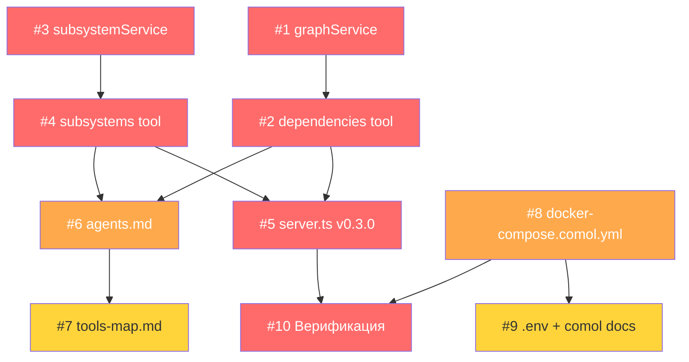

# Карта задач: MCP-сервер v0.3.0

Репозиторий: [Antiloop-git/MCP-RAQ-1C](https://github.com/Antiloop-git/MCP-RAQ-1C)
PRD: [docs/PRD-mcp-1c-v0.3.md](PRD-mcp-1c-v0.3.md)

## Сводная таблица

| Issue | Задача | Компонент | Приоритет | Размер | Зависит от | Статус |
|-------|--------|-----------|-----------|--------|------------|--------|
| [#1](https://github.com/Antiloop-git/MCP-RAQ-1C/issues/1) | graphService — граф зависимостей | backend | P0 | M | — | open |
| [#2](https://github.com/Antiloop-git/MCP-RAQ-1C/issues/2) | dependencies tool (1c_dependencies) | backend | P0 | S | #1 | open |
| [#3](https://github.com/Antiloop-git/MCP-RAQ-1C/issues/3) | subsystemService — сервис подсистем | backend | P0 | M | — | open |
| [#4](https://github.com/Antiloop-git/MCP-RAQ-1C/issues/4) | subsystems tool (1c_subsystems) | backend | P0 | S | #3 | open |
| [#5](https://github.com/Antiloop-git/MCP-RAQ-1C/issues/5) | Регистрация в server.ts v0.3.0 | backend | P0 | S | #2, #4 | open |
| [#6](https://github.com/Antiloop-git/MCP-RAQ-1C/issues/6) | Обновить agents.md (9 инструментов) | docs | P1 | M | #2, #4 | open |
| [#7](https://github.com/Antiloop-git/MCP-RAQ-1C/issues/7) | Обновить tools-map.md | docs | P2 | S | #6 | open |
| [#8](https://github.com/Antiloop-git/MCP-RAQ-1C/issues/8) | docker-compose.comol.yml (4 сервера) | infra | P1 | M | — | open |
| [#9](https://github.com/Antiloop-git/MCP-RAQ-1C/issues/9) | .env.example + comol-setup.md | docs+infra | P2 | S | #8 | open |
| [#10](https://github.com/Antiloop-git/MCP-RAQ-1C/issues/10) | Верификация и сборка | infra | P0 | S | #5, #8 | open |

## Диаграмма зависимостей

Цвета: 🔴 P0 (блокер) / 🟠 P1 (важно) / 🟡 P2 (желательно)

## Порядок реализации

### Волна 1 (параллельно, нет зависимостей):
- **#1** graphService + **#3** subsystemService + **#8** docker-compose.comol.yml

### Волна 2 (зависят от Волны 1):
- **#2** dependencies tool (← #1) + **#4** subsystems tool (← #3)

### Волна 3 (зависят от Волны 2):
- **#5** server.ts (← #2, #4)
- **#6** agents.md (← #2, #4)
- **#9** comol docs (← #8)

### Волна 4 (финал):
- **#7** tools-map.md (← #6)
- **#10** верификация (← #5, #8)

## Статистика

- Всего: **10 задач**
- P0 (блокер): 6 задач
- P1 (важно): 2 задачи
- P2 (желательно): 2 задачи
- Размер S: 6 задач, M: 4 задачи
